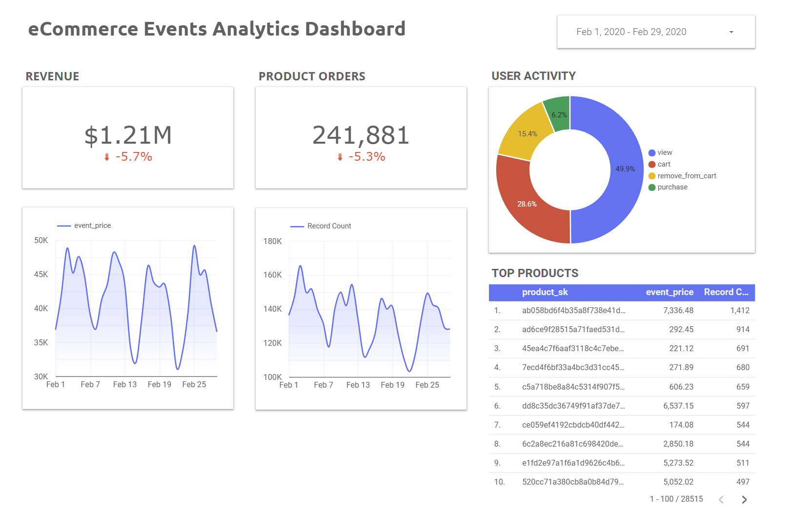

# eCommerce Events Data Pipeline and Analysis
An online flower shop, has been experiencing growth in website traffic and customer orders. The business wants to better understand user behavior, optimize marketing efforts, and improve sales performance. However, their raw ecommerce event data—such as product views, cart additions, and completed purchases is collected by CDP (Customer Data Platform).

To support data-driven decision-making, their company needs a data pipeline that ingests, processes, and transforms this raw event data into clean, structured tables and dashboards. These insights should help answer key questions like:

- What are the most popular flower products?
- How do users behave before making a purchase?
- What time of day or day of the week has the highest sales volume?
- Which users are most engaged or likely to return?

Kaggle Dataset can be found [here](https://www.kaggle.com/datasets/mkechinov/ecommerce-events-history-in-cosmetics-shop).

## Technologies
- IaC: Terraform
- Workflow Orchestration: Python/Airflow
- Data Lake: Google Cloud Storage (GCS)
- Data Warehouse: Google BigQuery + dbt
- Data Visualization: Looker Studio

## Data Pipeline


## Reproducibility
### Requirements
A virtual machine is recommended with the following:
- Python 3.9+
- Terraform
- Astro CLI (for Airflow)
- Docker CLI/Desktop 
- Google Service Account

> [!IMPORTANT]  
> In your Google Cloud Project, create a **Google Service Account** with the following roles:
> - BigQuery Admi
> - Storage Admin
> - Viewer
>
> Download the account credentials and place it on your system (e.g. `/home/<your-username>/.keys/project_creds.json`)

In the project root directory, you can use `./sudo setup.sh` to automatically install Docker, Terraform, and Astro CLI in your system.

### Setup Guidelines

After configuring your service account and terraform, navigate to `terraform/` directory and **modify** `variables.tf` config according to your project details

Then apply your settings to create the necessary dataset and gcs bucket:
```
terraform apply
```

Modify `docker-compose.override.yml` and modify `Dockerfile` (to be continued...)

Navigate to `airflow/` and start the orchestration using astronomer:
```
astro dev start
```

## Analytics Dashboard


You can view the live dashboard [here](https://lookerstudio.google.com/reporting/18ae7e54-43ec-426b-b21c-a5eaf34f6657)

## Future Improvements
- makefile
- more complete/detailed schema
- better metrics for dashboard